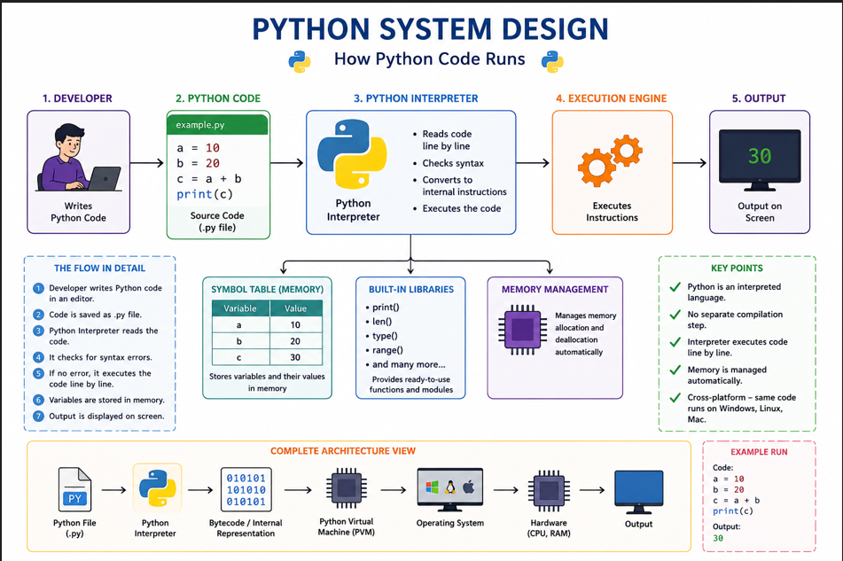

# Python From Scratch

A beginner-friendly guide to understanding Python, why it exists, how it works, and where it is used.

---

## What is Python?

Python is a programming language that helps humans give instructions to computers in a simple, readable way.

Think of it like a personal assistant:

- You say: "Display my name on the screen."
- Python understands your instruction.
- Python tells the computer what to do.

> Python makes programming easier by using words and structure that are close to human language.

---

## Why Was Python Created?

Before Python, writing programs often meant giving the computer many detailed steps.

For example:

- "Go to the kitchen"
- "Find a bottle"
- "Check if it has water"
- "Pick it up"
- "Bring it to me"

Python was created to reduce this complexity.

For example:

- Before Python: write each low-level step with many instructions
- After Python: use a simpler, shorter program that says what you want

Example comparison:

Before Python:
- Open the kitchen drawer
- Find the recipe book
- Read each step
- Chop the vegetables
- Cook the food
- Serve the plate

With Python:
- Write the recipe once
- Let the computer do the cooking steps automatically

Its philosophy is:

> "Programming should be easy for humans to read."

---

## Why Do We Need Python?

Python saves time by automating repetitive work.

Imagine this daily task:

- Open 100 Excel files
- Check customer records
- Create reports
- Save and send emails

Doing this manually can take hours.
With Python, you can write a single program to do it automatically.

### Benefits of Python

- Faster work
- Less chance of mistakes
- More time to focus on important decisions

---

## How Does Python Work?

When you write a command, Python reads it and performs the action for you.

Example code:

```python
print("Hello")
```

What happens:

1. Python reads your code.
2. Python understands you want to display a message.
3. Python tells the computer to show the message.
4. The screen displays:

```
Hello
```

---

## What is an Interpreter?

An interpreter is like a translator.

If a tourist speaks English and a local speaks Kannada, a translator helps them understand each other.

Similarly:

- You write instructions in Python
- The Python interpreter translates them
- The computer executes them

Flow:

You → Python Interpreter → Computer → Result

---

## Real Example

Say you want to add 10 and 20:

- You write the instruction
- Python understands it
- The computer calculates the result
- The answer is 30

This simple flow is the foundation of every Python program.

---

PYTHON SYSTEM DESIGN:


## Where is Python Used?

Python is used in many everyday services, even if you don't see it directly.

Examples:

- Netflix recommendations
- Data analysis
- Automation scripts
- Web applications
- Machine learning

> Python is everywhere because it is easy to learn, fast to write, and powerful enough for serious tasks.

---

## Learn More

This repository is a starting point for anyone who wants to learn Python from scratch.

Keep exploring with simple examples, practice often, and build your confidence step by step.

Amazon

Suggests products.

You buy a phone
      ↓
Python analyzes
      ↓
Suggests accessories
ChatGPT

A lot of AI systems are built using Python.

Question
    ↓
AI Processing
    ↓
Answer
Why Do Companies Love Python?

Because it helps them:

Reduce manual work
       ↓
Save time
       ↓
Reduce errors
       ↓
Increase productivity
One Example Related to Your MuleSoft Work

Suppose production support receives:

500 API errors

Instead of checking manually:

Python can:

Read logs
      ↓
Find failed APIs
      ↓
Prepare report
      ↓
Send email

in a few seconds.

The Simplest Definition

If someone asks:

"What is Python?"

You can answer:

"Python is a language that helps us talk to computers in a simple way. Instead of doing repetitive work ourselves, we tell Python what to do, and it makes the computer do the work for us."

Or even shorter:

"Python is like a smart translator between humans and computers."